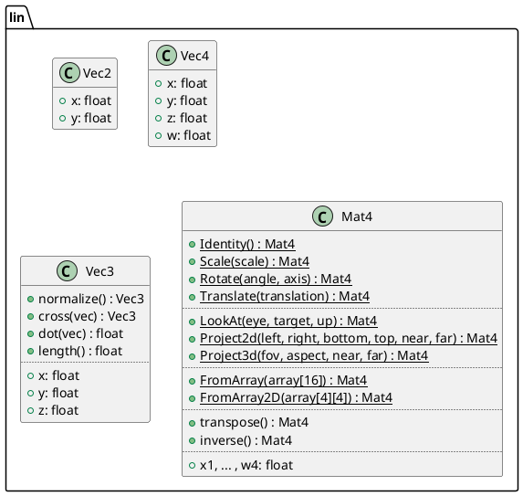
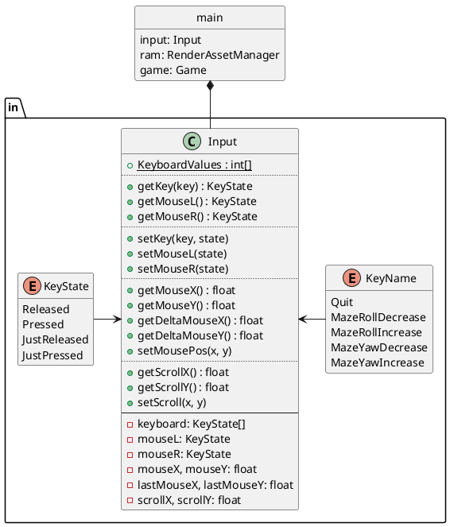
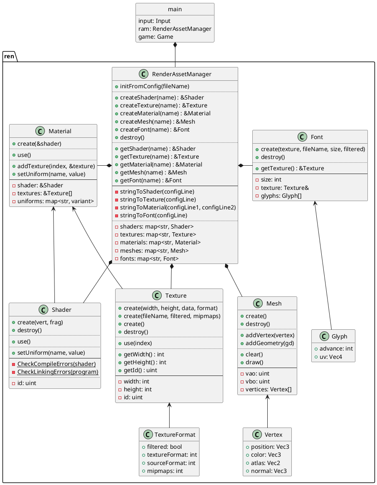
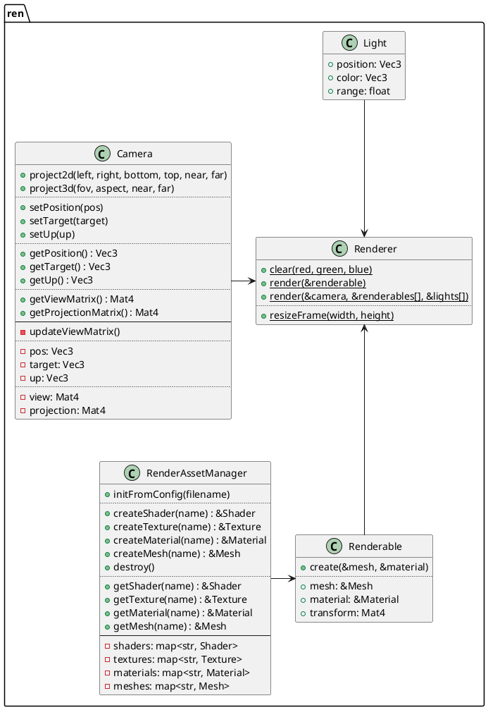
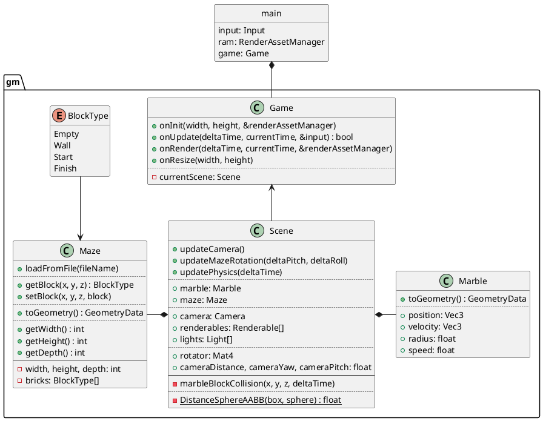

# Marble Maze

Marble Maze is a 3D game where you move the marble from start to finish by turning and tilting the maze.  
The game was made in C++, using GLFW for windowing and input, OpenGL for rendering and OpenAL for sound.


# Building

This project uses CMake, so make sure you have it installed.  

## UNIX systems (Linux, Mac, BSD)
You can build and run the project by running `./run.sh` in your terminal.  
If you prefer to build the release version, run `./run.sh build-release`.  

## Windows
Importing into Visual Studio as a CMake project works well.  
You can also build from the terminal by running:
```
cmake -S . -B build -DCMAKE_BUILD_TYPE="Debug"
cd build
make
```
For the release build, replace `Debug` with `Release`.

**When building the release version, make sure to move `res` to the `build` directory!**


# Design

The game consists of 5 main namespaces which contain classes with a loosely similar purpose.  
Those namespaces are:  
- `lin` for linear algebra and other math-related functionality
- `in` for input handling
- `ren` for rendering and managing underlying resources
- `snd` for playing sound and managing sound resources
- `gm` for everything related to game logic

## Math
The `lin` namespace contains `Vec3` and `Mat4` classes which are used by OpenGL for transformations.  
`Mat4` also contains static functions to generate commonly used matrices.  
This is the specification UML diagram for `lin`.  


## Input
The `in` namespace contains `Input` class, `KeyState` and `KeyName` enums.
It keeps track of which keys and mouse buttons are pressed and where the mouse is.  
Actual key names are held in `Input::KeyboardValues` which contains `GLFW_KEY` for each `KeyName`.  


## Rendering
The `ren` namespace is roughly split in 2 parts; asset management and rendering.

`RenderAssetManager` is the key in this role because it manages creation and deletion of
resources required for rendering.  
Classes `Texture` and `Shader` encapsulate their OpenGL functions and data,
while their references are used by `Material`.  
`Material` also hold relevant shader uniforms which can be an `int`, `uint`, `float` or `Mat4`.  
The `Mesh` class manages an OpenGL vertex array and it's relevant resources.  


Because separately using `Mesh` and `Material` would be tedious,
`Renderable` holds those together, along with a transformation matrix.  
Classes `Light` and `Camera` encapsulate data for OpenGL lighting and view/projection matrices.  
Rendering is handled by the `Renderer` class, which only contains methods for rendering.  
The game uses a forward-rendering pipeline so framebuffers aren't needed.  


## Sound
Sound will be implemented in future versions.

## Game
The `gm` namespace contains `Game` and `Scene` classes.  
`Scene` just holds data for the `Maze` and the `Ball`,
as well as the list of `Renderable`s, `Light`s and the game `Camera`.  
`Scene`'s only functionality is updating the physics simulation,
because `Game` takes care of rendering by passing the data to the `Renderer`.  

