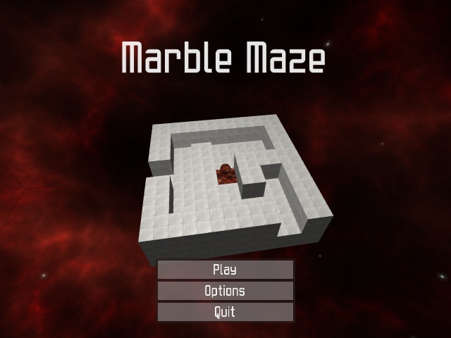
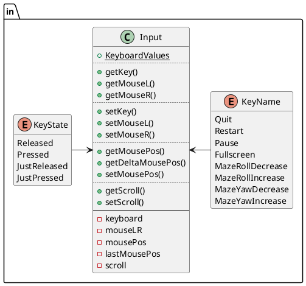
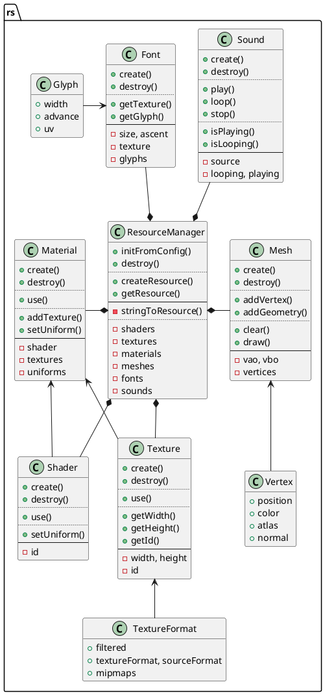
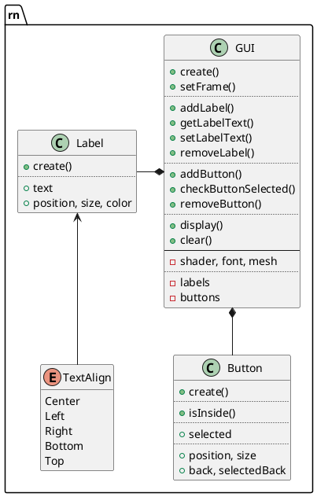
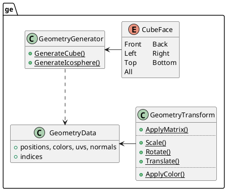
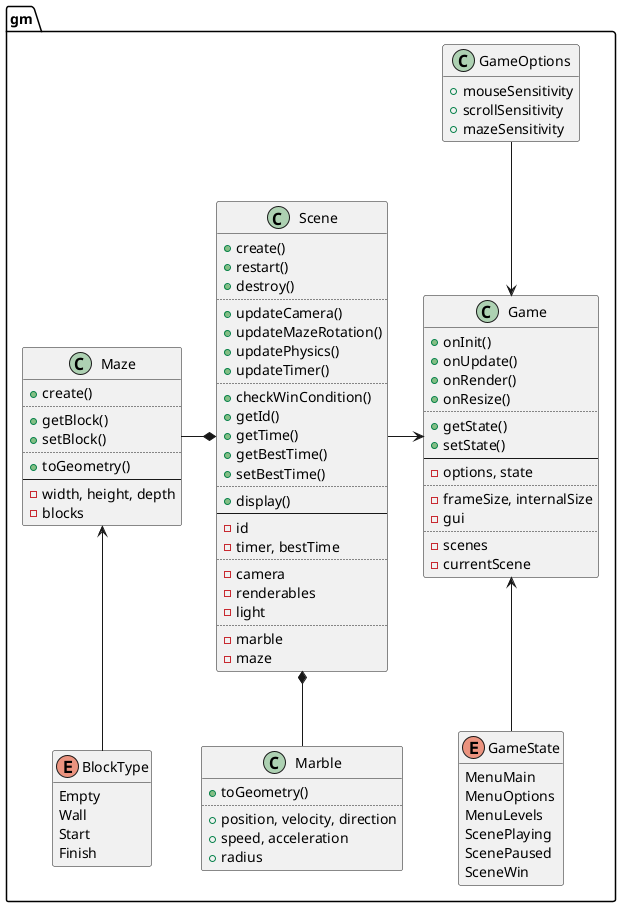

# Marble Maze
Marble Maze is a 3D game where you move the marble from start to finish by turning and tilting the maze.  
The game was made in C++, using GLFW for windowing and input, OpenGL for rendering and miniaudio for sound.  


# Building
This project uses CMake, so make sure you have it installed.  

## UNIX systems (Linux, Mac, BSD)
You can build and run the project by running `./run.sh` in your terminal.  
If you prefer to build the release version, run `./run.sh build-release`.  

## Windows
Importing into Visual Studio as a CMake project works well.  
You can also build from the terminal by running:
```
cmake -S . -B build -DCMAKE_BUILD_TYPE="Debug"
cd build
make
```
For the release build, replace `Debug` with `Release`.

**When building the release version, make sure to move `res` to the `build` directory!**

# Design
The game consists of 6 main namespaces which contain classes with a loosely similar purpose.  
- `la` for linear algebra and other math-related functionality
- `in` for input handling
- `rs` for managing resources
- `rn` for rendering
- `ge` for generating mesh geometry
- `gm` for everything related to game logic

## Math
The `la` namespace contains `Vec2`, `Vec3`, `Vec4` and `Mat4` classes which are used by OpenGL for transformations.  
`Mat4` also contains static functions to generate commonly used matrices.  


## Input
The `in` namespace contains `Input` class, `KeyState` and `KeyName` enums.
It keeps track of which keys and mouse buttons are pressed and where the mouse is.  
Actual key names are held in `Input::KeyboardValues` which contains `GLFW_KEY` for each `KeyName`.  


## Resource management
The `rs` namespace contains `ResourceManager` class
which is responsible for creation and deletion of memory-related resources.
Classes `Texture` and `Shader` encapsulate their OpenGL functions and data,
while their references are used by `Material`.
`Material` also hold relevant shader uniforms.  
The `Mesh` class manages an OpenGL vertex array and it's relevant resources.  
The `Font` class is responsible for loading TTF fonts into an OpenGL texture and holding glyph information.  
The `Sound` class is a wrapper for miniaudio's `ma_sound` and it holds all logic needed for the game's audio.  


## Rendering
The `rn` namespace is roughly split in 2 parts; rendering and GUI.

Because separately using `Mesh` and `Material` would be tedious,
`Renderable` holds those together, along with a transformation matrix.  
Classes `Light` and `Camera` encapsulate data for OpenGL lighting and view/projection matrices.  
Rendering is handled by the `Renderer` class, which only contains methods for rendering.  
The game uses a forward-rendering pipeline so framebuffers aren't needed.  


User interface is handled by the `GUI` class which holds `Label`s.  
Rendering of the UI is called by the `Game` class.  


## Mesh geometry
The `ge` namespace contains `GeometryData`, `GeometryGenerator` and `GeometryTransform` classes.  
Class `GeometryData` has no functionality and all operations are done by helper classes.  


## Game
The `gm` namespace contains `Game` and `Scene` classes.  
`Scene` holds data for the `Maze` and the `Ball`,
as well as the list of `Renderable`s, `Light`s and the game `Camera`.  
`Scene`'s functionality is updating the physics simulation and the camera,
while `Game` takes care of passing input and rendering accordingly.  


## How it all ties together
The `main` function holds `Input`, `ResourceManager` and `Game` classes, initializing and destroying them .  
It also does the initialization and destroying of resources for GLFW and miniaudio, as well as running the program loop at a fixed tick-rate.  

